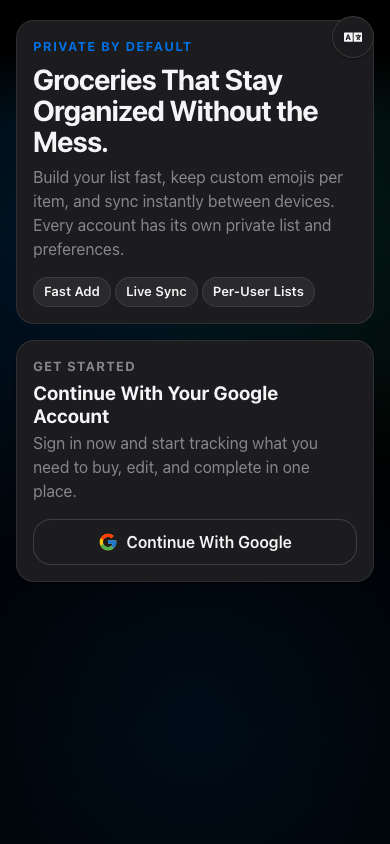
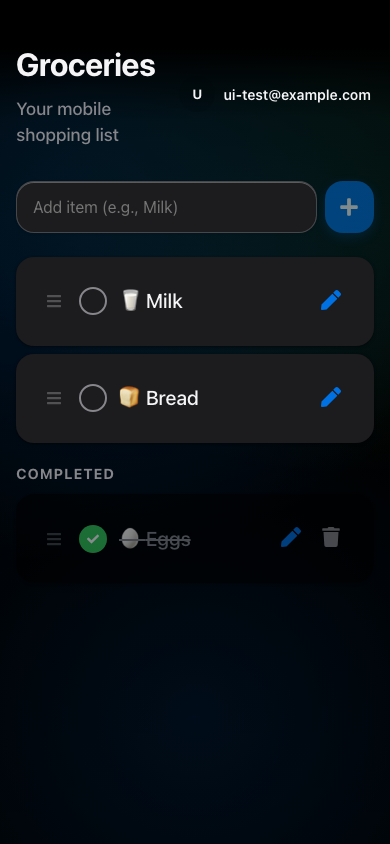

# 🛒 Shopping List PWA

A premium, mobile-first shopping list Progressive Web App designed with a minimalist aesthetic that Jony Ive would approve of.

This is a **simple vibe coded app**, built entirely by **Gemini 3 Pro** using **Antigravity**.

## ✨ Features

-   **Mobile-First Design**: Optimized for one-handed use and touch interaction.
-   **Jony Ive Aesthetic**: Minimalist layout, subtle blurs, and premium typography.
-   **Google Authentication**: Onboarding + sign in required before list access.
-   **Per-User Data Isolation**: Each Firebase user gets an independent shopping list and custom emoji map.
-   **Smart Emoji Selection**: Automatically assigns emojis to your grocery items (e.g., "Milk" -> 🥛).
-   **PWA Ready**: Installable on iOS and Android for a native app feel.
-   **Real-time Sync**: Uses Firebase Firestore to keep your list synced across devices.
-   **Animations**: Fluid transitions powered by Framer Motion.

## 🚀 Tech Stack

-   **Framework**: [React](https://reactjs.org/)
-   **Bundler**: [Vite](https://vite.dev/)
-   **Auth**: [Firebase Authentication](https://firebase.google.com/products/auth)
-   **Database**: [Firebase Firestore](https://firebase.google.com/products/firestore)
-   **Styling**: Vanilla CSS (CSS Variables)
-   **Animations**: [Framer Motion](https://www.framer.com/motion/)
-   **Icons**: [React Icons](https://react-icons.github.io/react-icons/)

## 🛠️ Setup

1.  **Clone & Install**:
    ```bash
    git clone git@github.com:Extraterra1/Shopping-List.git
    cd Shopping-List
    npm install
    ```

2.  **Environment Variables**:
    Create a `.env` file in the root and add your Firebase configuration:
    ```env
    VITE_FIREBASE_API_KEY=your_key
    VITE_FIREBASE_AUTH_DOMAIN=your_domain
    VITE_FIREBASE_PROJECT_ID=your_id
    VITE_FIREBASE_STORAGE_BUCKET=your_bucket
    VITE_FIREBASE_MESSAGING_SENDER_ID=your_sender_id
    VITE_FIREBASE_APP_ID=your_app_id

    # Optional local emulator flags
    VITE_USE_FIRESTORE_EMULATOR=false
    VITE_FIRESTORE_EMULATOR_HOST=localhost
    VITE_FIRESTORE_EMULATOR_PORT=8080
    VITE_USE_AUTH_EMULATOR=false
    VITE_AUTH_EMULATOR_HOST=localhost
    VITE_AUTH_EMULATOR_PORT=9099
    ```

3.  **Firebase Console Setup**:
    - Enable **Authentication > Sign-in method > Google**.
    - Add your local and production domains to **Authentication > Settings > Authorized domains**.
    - Deploy Firestore rules from this repo so user isolation is enforced:
      ```bash
      firebase deploy --only firestore:rules
      ```

4.  **Run Development Server**:
    ```bash
    npm run dev
    ```

## 🧭 How To Use (Add Items To Your List)

### 1. Open the app and sign in
When you first open the app, you land on the onboarding screen. Sign in with Google to access your private list.



### 2. Add a new item
Use the input field at the top of the list and tap the `+` button.

Example:
1. Type `milk`
2. Tap `+`
3. The item appears in your active list with an auto-selected emoji

### 3. Mark items complete or keep them active
Tap the checkbox to move an item between active and completed sections.

In this example, some items are active and one is completed:



### 4. Edit an item
Tap the edit icon on an active item to change its name or emoji, then save.


## 🔐 Security Notes

- `VITE_E2E_AUTH_BYPASS` is intended for automated UI tests only.
- Never enable `VITE_E2E_AUTH_BYPASS=true` in production builds or deployed environments.

## 📜 License

MIT

---
*Coded with 🤍 by Gemini 3 Pro via Antigravity*
